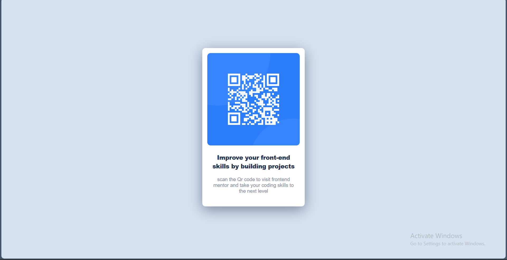

# Frontend Mentor - QR code component solution

This is a solution to the [QR code component challenge on Frontend Mentor](https://www.frontendmentor.io/challenges/qr-code-component-iux_sIO_H). Frontend Mentor challenges helps you improve your coding skills by building realistic projects. 

## Table of contents
- [Overview](#overview)
  - [Screenshot](#screenshot)
  - [Links](#links)
- [My process](#my-process)
  - [Built with](#built-with)
  - [What I learned](#what-i-learned)
  - [Continued development](#continued-development)
- [Author](#author)

## Overview
  i studied the provided project resources, used my available resources and built it to the best of my abilities

### Screenshot

### Links
- Solution URL: https://github.com/InfiniteSyntax30/qrcodeComponent.git
- Live Site URL: https://d-frontend-mentor-qr-code-component.netlify.app/

## My process
i wrote the markup for the whole project first, then wrote the styling using CSS3. 
it was a fun experience.

### Built with
- Semantic HTML5 markup
- CSS custom properties
   
### What I learned
i am getting back to coding so this was a nice restart, reminding me of some things and how fun coding can be.

### Continued development
i want to focus more on color mixing and choosing to build vibrant sites.

## Author
- Frontend Mentor - [@InfiniteSyntax30](https://www.frontendmentor.io/profile/InfiniteSyntax30)
- Twitter - [@Damian_30_d](https://www.twitter.com/Damian_30_d)
